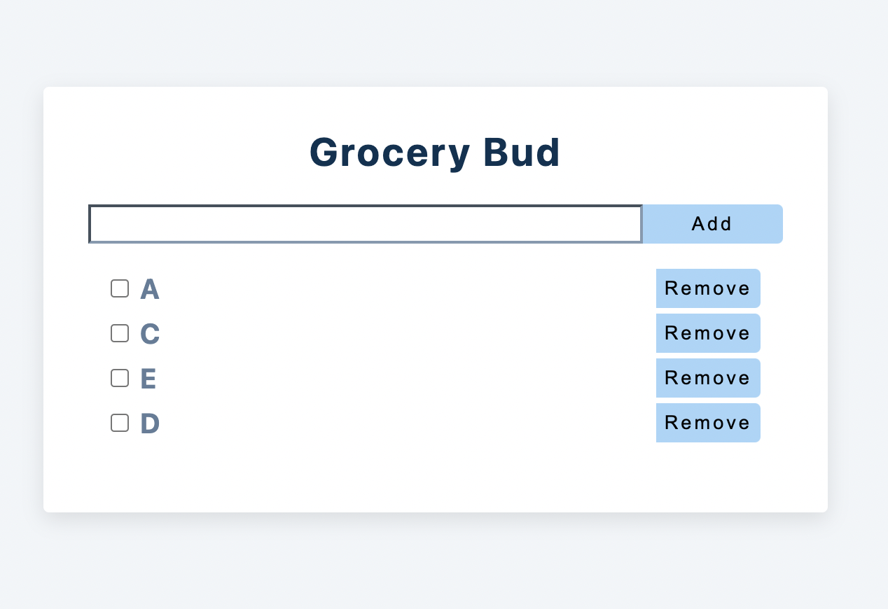

## Grocery Web

### Description

- A web of grocery item list
- The item can be added by typing in the input box and clicking the add button
- The item can be ticked and un-ticked by clicking the check box
- The item can be removed by clicking the remove button
- The items can be saved locally so it will remain after web refreshing
- Toast messages will appear when the input item is empty, when the item has been added successfully and when the item has been removed successfully

### A capture of the web

